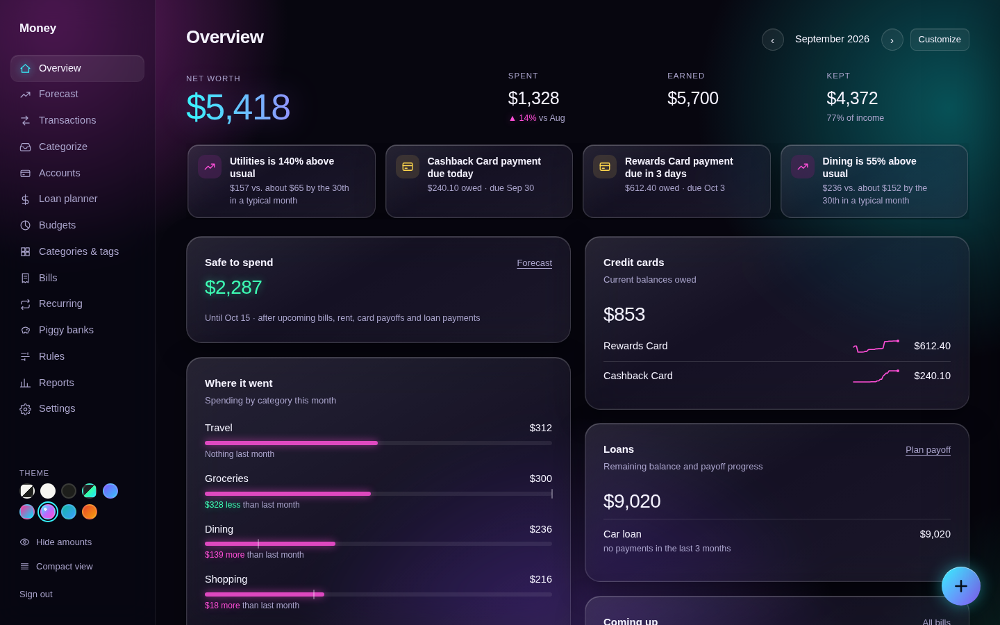
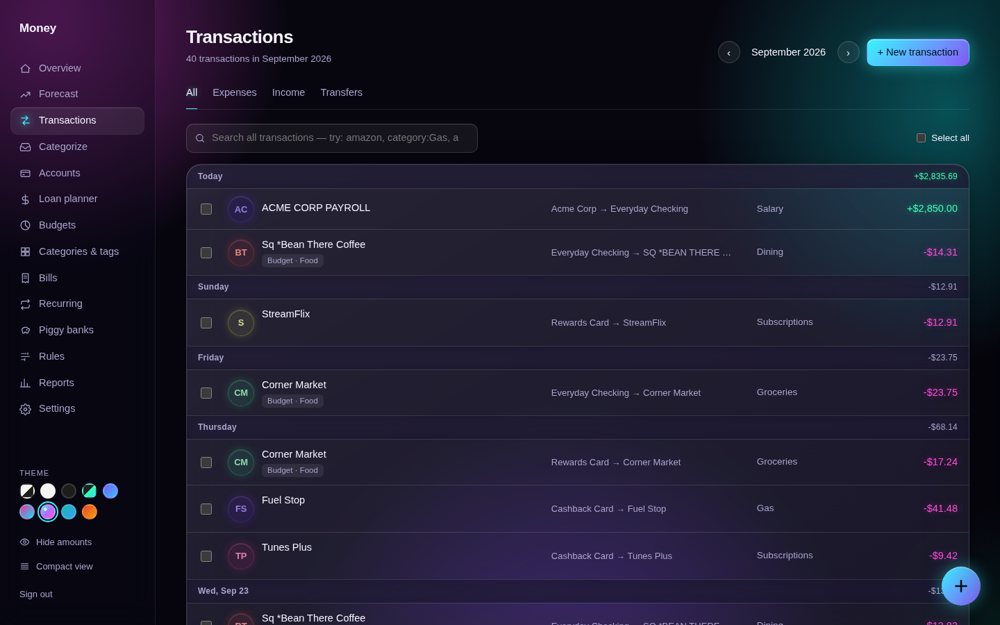
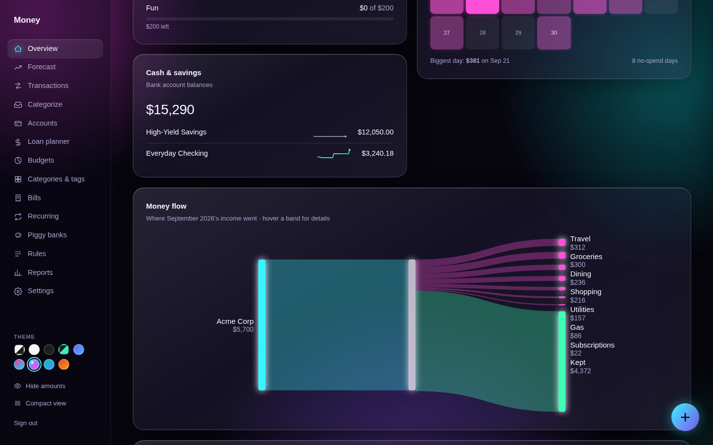
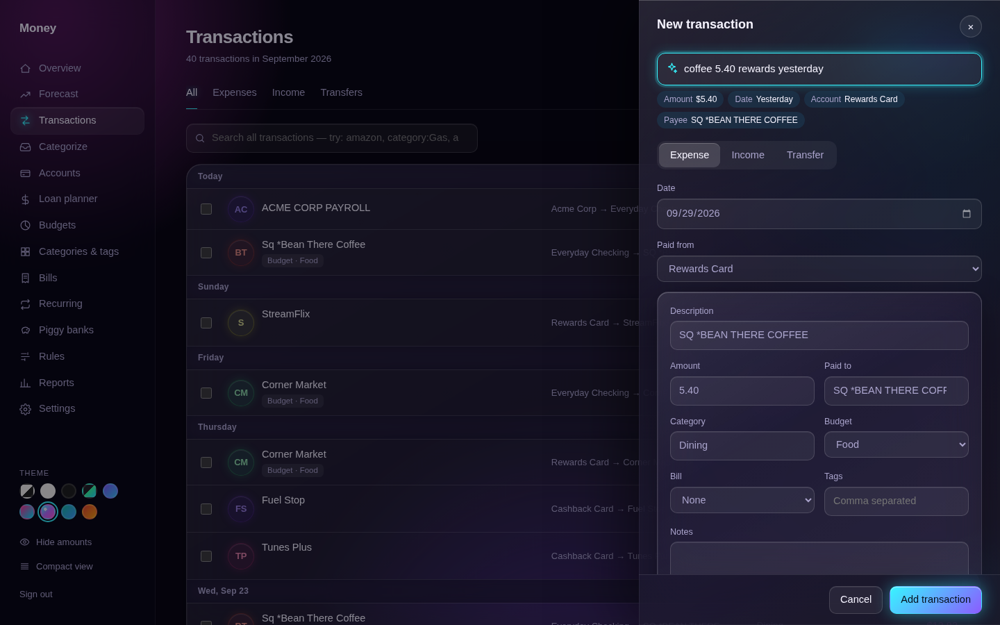
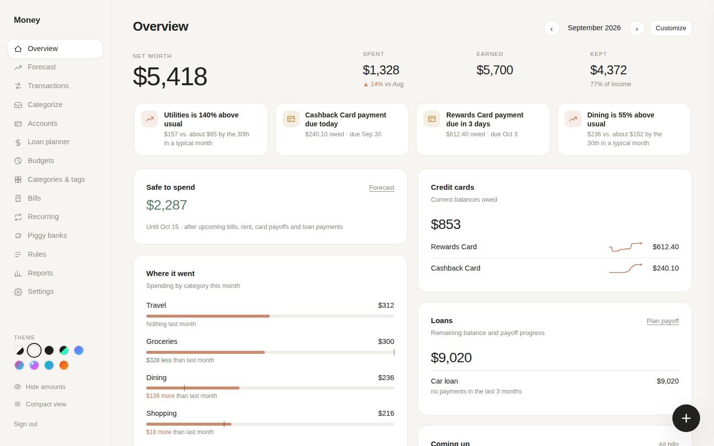
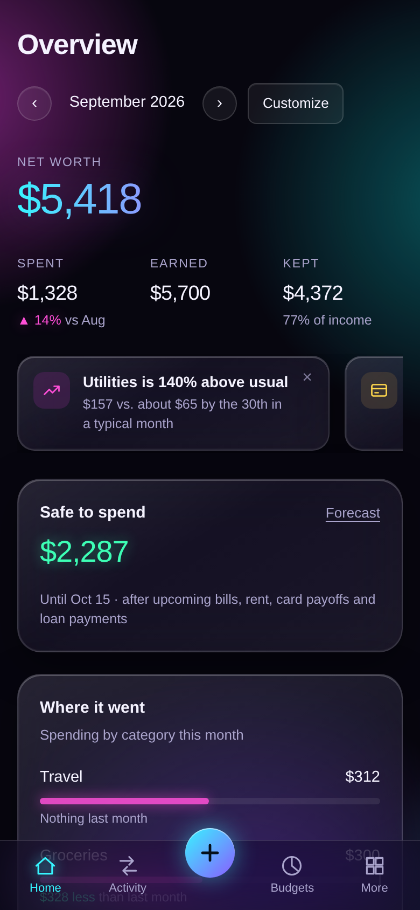
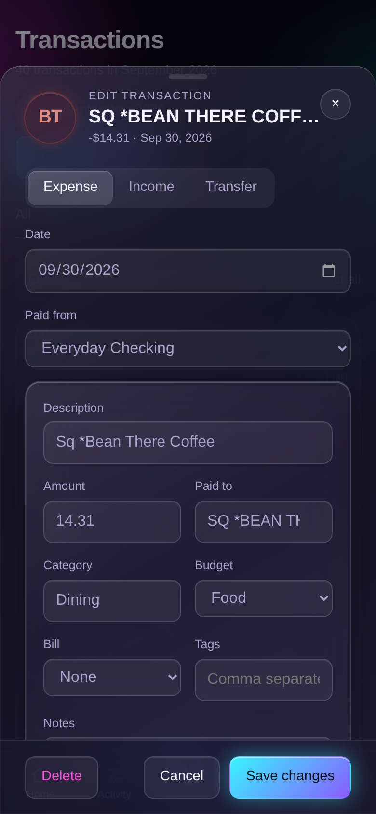

# Money: a modern frontend for Firefly III

Money is a fast, mobile-friendly web app for [Firefly III](https://www.firefly-iii.org/), the self-hosted personal finance manager. It sits beside your existing Firefly server and talks to it through the Firefly API. It doesn't change or replace Firefly, and your data never leaves your server.

It's plain HTML, CSS and JavaScript served by a small nginx container. Nothing to build and no dependencies.



<p>
  
  
</p>
<p>
  
  
</p>
<p>
  
  
</p>

*Screenshots use the built-in demo data (all names and amounts are made up), shown in the Liquid glass neon theme and, bottom right, Calm light.*

## Features

**Everyday use**
- **Overview:** net worth, spending by category against last month, budgets, balances with 30-day sparklines, loans, upcoming bills, cash flow, a daily-spending calendar and a money-flow chart.
- **Insight cards:** short notes like "Dining is 46% above usual", "Groceries budget may run out around the 24th" or "Card payment due in 4 days". They compare this month with the same point in each of the last three months.
- **Customizable dashboard:** drag cards to reorder them, make them full width, or hide them.
- **Safe-to-spend forecast:** detects your paydays and subtracts upcoming bills, recurring transactions, card payoffs and loan payments.
- **Transactions:** a feed grouped by day with sticky headers, merchant avatars and infinite scroll. You can change a category or budget inline, edit several at once, split, search, attach files and link transactions.
- **Quick add in plain words:** type `coffee 5.40 amex yesterday`, `paycheck 2850 chase` or `transfer 400 from checking to savings last friday` and the form fills itself in. Payee memory then fills in the category and budget from the last time.
- **Categorize inbox:** go through uncategorized expenses with keyboard shortcuts, and create a rule in one click.
- **Loan payoff planner:** compare snowball, avalanche and no-rollover strategies.
- **Covers most of Firefly:** accounts and reconciliation, budgets and available budget, categories, tags, bills, recurring transactions, piggy banks, the rules editor (with test and run), reports, currencies and exchange rates, CSV exports and webhooks.

**Feel**
- Animated page and edit-panel transitions (View Transitions API), with instant fallback in other browsers and when reduced motion is on.
- Changes show right away and roll back if Firefly refuses them. Deleting has an undo option.
- **Phone:** bottom tab bar, bottom sheets you can drag down to close, swipe to delete, pull to refresh, and light vibration on supported devices.
- **Keyboard:**
  - `J`/`K` move through transactions and `Enter` opens one.
  - `C` and `B` change the category or budget, and `X` selects.
  - `N` adds a transaction, `/` searches, `⌘/Ctrl-K` opens the command palette, and `P` hides amounts.
  - `?` lists all the shortcuts.
- Nine themes (Calm light, dark and auto; Midnight; Neon; Liquid glass neon; Ocean; Sunrise; Carbon neon), a **hide amounts** privacy mode and a **compact** density option.
- Installable as an app (PWA). Opens instantly with the last data this device saw, refreshes in the background, and works read-only while offline.

## How it works

```
Browser ──(password in a header)──▶ nginx container ──(your Firefly token)──▶ Firefly III API
          serves the app             checks the password,
                                     adds the token, proxies /api/
```

- nginx serves the app (`index.html` and its `assets/`) and proxies `/api/*` to Firefly III.
- Your Firefly **access token lives only in the nginx container**. It's added on the server side and never sent to the browser.
- The browser has to send the **dashboard password** (`X-Dash-Key` header) with every API call. Without it nginx answers `401`.

## Requirements

- A running **Firefly III** (built for 6.x; uses API v1).
- A Firefly **Personal Access Token**: in Firefly go to *Options → Profile → OAuth → Personal access tokens → Create new token*.
- Docker (or any way to run `nginx:alpine`). It uses very little memory.

## Quick start (Docker)

Every push to `main` builds a ready-to-run image, `ghcr.io/muffy0906/firefly-money`, using GitHub Actions (`.github/workflows/docker.yml`). You don't need to download any files, just the compose file:

```bash
mkdir money && cd money
curl -O https://raw.githubusercontent.com/muffy0906/firefly-money/main/docker-compose.yml
curl -o .env https://raw.githubusercontent.com/muffy0906/firefly-money/main/.env.example
# edit .env (the image name in docker-compose.yml already points at this repo's build)
docker compose up -d
```

Open `http://<your-server>:8090` and sign in with your `DASH_PASSWORD`.

| Variable        | What it is |
|-----------------|------------|
| `FIREFLY_URL`   | How the container reaches Firefly, e.g. `http://192.168.1.20:8080` or `http://firefly:8080` (same Docker network). No trailing slash. It's also used for the sidebar's "Open Firefly III" link, so a LAN address works better than a Docker-only hostname if you want that link to work. |
| `FIREFLY_TOKEN` | Your Firefly Personal Access Token. |
| `DASH_PASSWORD` | The password for the Money sign-in screen. Use something long, and don't start it with `~`. |
| `MONEY_PORT`    | Port on the host (default `8090`). |

**Updating:** `docker compose pull && docker compose up -d`. To stay on a fixed version instead of `latest`, use a release tag such as `:1.2.0`. Those images are built when you push a tag like `v1.2.0`.

**Prefer plain files?** The comments at the bottom of `docker-compose.yml` show how to run the stock `nginx` image with `app/index.html`, `app/default.conf.template` and the `app/assets` folder mounted from a folder. In that setup, you update by replacing the files and restarting the container.

### TrueNAS SCALE (24.10 and newer)

1. **Apps → Discover Apps → ⋮ → Install via YAML**, give it a name like `money`, and paste:

   ```yaml
   services:
     money:
       image: ghcr.io/muffy0906/firefly-money:latest
       pull_policy: always          # fetch the newest image whenever the app is (re)started
       restart: unless-stopped
       ports:
         - "8090:80"
       environment:
         FIREFLY_URL: http://192.168.1.20:8080
         FIREFLY_TOKEN: paste-your-token
         DASH_PASSWORD: choose-a-long-password

   # Adds the "Web UI" button to the app in TrueNAS. Keep the port the same as the one above.
   x-portals:
     - name: Web UI
       scheme: http
       host: 0.0.0.0
       port: 8090
       path: /
   ```

   `host: 0.0.0.0` means "this NAS's address". If you use HTTPS through a reverse proxy, set `scheme: https`, and set `host` and `port` to your proxy's address instead.
2. **Updating:** when TrueNAS sees a newer image, the app shows **Update available**, and **Update** pulls it and restarts. If your TrueNAS version doesn't show the badge for custom apps, **Stop** and **Start** the app. The `pull_policy: always` line makes it fetch the newest image on start.
   To check which version is running, open **Settings → About** in Money: *Money version* shows the commit and build date (e.g. `c78fd51 · 2026-09-30`). It should match the latest commit on the repo's main page.
3. If the image fails to pull with a "denied" or "unauthorized" error, make the package public. On GitHub, open your profile → **Packages** → the package → **Package settings → Change visibility → Public**.
4. **App icon (optional):** TrueNAS has no icon setting for apps installed via YAML, but you can set one in the app's own metadata file. In **System → Shell**, run `sudo nano /mnt/.ix-apps/app_configs/<app-name>/metadata.yaml`, and set the `icon:` line to:
   ```
   icon: https://raw.githubusercontent.com/Muffy0906/firefly-money/main/docs/icon.png
   ```
   Save and refresh the Apps page. Edit this per-app file, not `/mnt/.ix-apps/metadata.yaml`, which TrueNAS rewrites on updates. The logo is also in `docs/icon.svg`.

### Running behind a reverse proxy

Point your proxy (Caddy, Traefik, Nginx Proxy Manager, Cloudflare Tunnel…) at the container's port. Two things to know:
- **Use HTTPS** for anything beyond your home network. The password is sent with every request.
- Installing as an app and the offline cache only work over HTTPS (or on `localhost`).

## Security notes

- Money has **one shared password** and no user accounts. Treat it like the key to your finances. The safest setup is on your LAN or behind a VPN (Tailscale, WireGuard), or behind a reverse proxy that adds its own sign-in (Authelia, Cloudflare Access…).
- The nginx config has no rate limiting on password attempts. If you expose Money to the internet, add it at your proxy or use one of the options above.
- The Firefly token isn't exposed to the browser, but anyone with the dashboard password can do anything the token can (read, edit, delete).
- If you tick *Keep me signed in*, the browser remembers the password in `localStorage` and keeps a copy of your Firefly data on the device (IndexedDB and the offline cache) so the app opens instantly. Without it, nothing is kept after the tab closes. **Sign out** (or any trip back to the sign-in screen) deletes the password and all of that saved data. Don't tick it on shared computers.
- Found a security problem? Please report it privately through this repo's **Security → Report a vulnerability** page rather than a public issue.

## Try it without Firefly (demo mode)

A small Python server with made-up data is included:

```bash
python3 dev/mock_server.py
# open http://127.0.0.1:8765 and sign in with: demo
```

It implements only the endpoints the UI needs. Writes are accepted but not saved (deletes are the exception).

## Development

- The app is plain HTML, CSS and JavaScript with no framework and no build step:
  - **`app/index.html`**: the page itself (nginx fills in `FIREFLY_URL` and the version stamp at startup).
  - **`app/assets/money.css`**: all styles and themes.
  - **`app/assets/js/`**: the scripts, loaded in this order and sharing one global scope: `boot.js` (in `<head>`: shell and theme before first paint), `events.js` (attaches the markup's `data-on*` handlers), `core.js` (API, lists, router, main pages), `extras.js` (bulk edit, reconcile, rules, recurring, reports, settings), `polish.js` (quick add, undo, palette, date picker), `planning.js` (forecast, categorize inbox, loan planner, offline), `insights.js` (insight cards), `ui.js` (privacy, gestures, inline edits, dashboard, charts, natural-language quick add) and `shell.js` (the iPhone app shell). Markup handlers are written as `data-onclick="App.name('arg', this.value)"` (also `data-onchange`, `data-onsubmit`, …), never `onclick=`: the Content-Security-Policy blocks inline script, and `events.js` only runs calls to methods of the global `App` object.
- A few settings sit at the top of `app/assets/js/core.js` (for example `LOAN_MONTHLY_PAYMENT`, the fallback used for loan "months to go" estimates).
- Per-device preferences (theme, dashboard layout, privacy/density, forecast options, dismissed insights) are stored in `localStorage` under `money.*` / `moneyTheme`. Everything else lives in Firefly.
- **Publishing a new version:** push to `main`, and GitHub Actions builds a new `latest` image in a few minutes (see the repo's **Actions** tab). For a numbered release, push a tag: `git tag v1.2.0 && git push --tags`.
- **Smoke test:** opens every page and every "new …" form on desktop and phone sizes against the demo server, and fails on any JavaScript error:

  ```bash
  pip install playwright && playwright install chromium
  python3 dev/mock_server.py &
  python3 dev/smoke_test.py                           # add --shots docs/screenshots to refresh the images
  ```

## Browser support

Developed and tested in Chromium-based browsers (Chrome, Edge) on desktop and phone sizes. It uses only standard web features and should work in current Safari and Firefox. Please open an issue if something looks off there. Animated transitions need the View Transitions API (Chrome/Edge 111+, Safari 18+); other browsers switch views instantly instead. Vibration only works in browsers that support it (mainly Chrome on Android).

## Limitations

- Only one currency is shown per total (your Firefly primary currency). Foreign amounts are shown on individual transactions.
- Your Firefly profile, 2FA, API tokens and user management aren't available through Firefly's API, so change those in Firefly itself.
- Inline edits and the quick-add box handle single-split transactions. Split transactions open the full editor.

## Disclaimer

**Built with AI assistance.** Most of the code in this project was written with the help of an AI assistant (Claude, by Anthropic), directed, reviewed and tested by a human maintainer. It has been checked with the included smoke test and used against a real Firefly III server, but it hasn't had an independent code review. Read the code before trusting it with your finances, and report anything that looks wrong.

This is an independent project. It is not affiliated with or endorsed by Firefly III or its author. "Firefly III" is used only to describe what this app works with. Use it at your own risk and keep backups of your Firefly database.

## License

[PolyForm Strict 1.0.0](LICENSE): you may use Money for any noncommercial purpose, such as personal or household use or use by a charity or school. You may not change it, share or distribute copies, or sell it.

Want to use it commercially, change it, or contribute? Please ask first by opening an issue.
